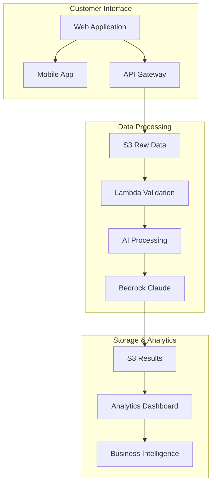

# AWS AI Customer Feedback System

[](https://opensource.org/licenses/MIT)
[](https://aws.amazon.com)
[](https://www.python.org/)
[](https://developer.mozilla.org/en-US/docs/Web/JavaScript)

A production-ready, comprehensive customer feedback system that processes multimodal data (text, images, audio) using AWS AI services and prepares it for foundation model analysis with Claude in Amazon Bedrock.

## 🚀 Quick Start

### Prerequisites
- AWS Account with appropriate permissions
- AWS CLI installed and configured
- Python 3.8+ and Node.js 16+
- Git for version control

### 5-Minute Deployment
```bash
# 1. Clone the repository
git clone https://github.com/lantzmurray/AWS_AIP_CustomerFeedback.git
cd AWS_AIP_CustomerFeedback

# 2. Set your configuration
export USER_ID=YOUR_UNIQUE_ID
export AWS_REGION=YOUR_AWS_REGION
export ACCOUNT_ID=YOUR_AWS_ACCOUNT_ID

# 3. Run automated deployment
./scripts/deploy.sh

# 4. Upload sample data
aws s3 sync sample_data/ s3://customer-feedback-analysis-${USER_ID}-raw/

# 5. Access your system
echo "Frontend URL: https://$(aws cloudfront list-distributions | jq -r '.DistributionList.Items[0].DomainName')"
```

## 📋 Project Overview

This AWS AI Project demonstrates modern cloud architecture and AI integration capabilities through a comprehensive customer feedback processing system. The project was developed by **Lantz Murray** as a demonstration of production-ready serverless architecture with multimodal AI processing.

**Author**: [Lantz Murray](https://www.linkedin.com/in/lantz-murray/)

### Key Features
- **Multimodal Data Processing**: Handles text reviews, product images, audio recordings, and survey responses
- **Real-time Validation**: Automated data quality checks and validation with configurable thresholds
- **AI-Powered Insights**: Integration with AWS AI services and foundation models
- **Scalable Architecture**: Event-driven, serverless design for cost-effective scaling
- **Comprehensive Monitoring**: Real-time dashboards and alerting
- **Enterprise Security**: Full compliance and data protection measures

## 🏗️ System Architecture

### High-Level Architecture



### Key Components

#### Data Ingestion Layer
- **Multi-channel Input**: Web, mobile, API, third-party integrations
- **Format Support**: Text, images, audio, surveys, structured data
- **Real-time Validation**: Immediate quality checks and scoring
- **Secure Storage**: Encrypted S3 buckets with versioning

#### Processing Layer
- **AI-Powered Analysis**: 
  - Amazon Comprehend for text analysis
  - Amazon Textract + Rekognition for image processing
  - Amazon Transcribe for audio transcription
  - Amazon SageMaker for advanced processing
- **Foundation Models**: Claude integration for advanced insights
- **Quality Assurance**: Automated validation and monitoring

#### Output Layer
- **Actionable Insights**: Business-ready intelligence
- **Interactive Dashboards**: Real-time analytics and reporting
- **API Access**: Programmatic access for integrations
- **Alert Systems**: Proactive notifications and monitoring

## 📁 Repository Structure

```
aws-ai-customer-feedback/
├── README.md                          # This file
├── LICENSE                            # MIT License
├── CONTRIBUTING.md                     # Development guidelines
├── SECURITY.md                        # Security considerations
├── CHANGELOG.md                       # Version history
├── .gitignore                         # Git ignore rules
├── docs/                              # User documentation
│   ├── user-guide/                    # End-user guides
│   ├── api-reference/                  # API documentation
│   └── troubleshooting/               # Troubleshooting guides
├── architecture/                      # Technical architecture
│   ├── diagrams/                      # Architecture diagrams
│   └── technical-design/              # Design documents
├── deployment/                        # Deployment resources
│   ├── infrastructure/                 # CloudFormation/Terraform
│   ├── scripts/                       # Deployment scripts
│   └── configuration/                # Configuration files
├── src/                               # Source code
│   ├── lambda/                        # Lambda functions
│   ├── frontend/                      # Web frontend
│   └── utils/                         # Shared utilities
├── tests/                             # Test suites
├── sample_data/                       # Sample data for testing
└── scripts/                           # Utility scripts
```

## 🛠️ Technology Stack

### Backend
- **Python 3.8+**: Lambda functions and data processing
- **AWS Services**: Comprehensive cloud integration
- **Serverless Architecture**: Lambda, API Gateway, S3
- **Event-Driven Processing**: S3 triggers, Step Functions

### AI/ML Services
- **Amazon Comprehend**: Natural language processing
- **Amazon Textract**: Text extraction from images
- **Amazon Rekognition**: Image and video analysis
- **Amazon Transcribe**: Speech-to-text conversion
- **Amazon Bedrock**: Foundation model integration

### Frontend
- **HTML5/CSS3/JavaScript ES6+**: Modern web standards
- **Responsive Design**: Mobile-first approach
- **Real-time Updates**: WebSocket connections
- **Interactive Visualizations**: Chart.js, D3.js

## 📚 Documentation

### User Documentation
- [Getting Started Guide](docs/user-guide/getting-started.md)
- [API Reference](docs/api-reference/README.md)
- [Troubleshooting](docs/troubleshooting/README.md)

### Technical Documentation
- [Architecture Overview](architecture/technical-design/README.md)
- [Deployment Guide](deployment/README.md)
- [Development Setup](CONTRIBUTING.md)

## 🧪 Testing

### Running Tests
```bash
# Run all tests
npm test

# Run unit tests only
npm run test:unit

# Run integration tests only
npm run test:integration

# Run tests with coverage
npm run test:coverage
```

### Test Structure
- **Unit Tests**: Individual component testing
- **Integration Tests**: End-to-end workflow validation
- **Performance Tests**: Load and stress testing
- **Security Tests**: Vulnerability assessment

## 🚀 Deployment

### Prerequisites
- AWS CLI configured with appropriate permissions
- Docker (for local testing)
- Node.js 16+ and Python 3.8+

### Deployment Options

#### Option 1: Automated Deployment
```bash
./scripts/deploy.sh
```

#### Option 2: Manual Deployment
```bash
# Deploy infrastructure
cd deployment/infrastructure
terraform apply

# Deploy Lambda functions
cd ../../src/lambda
./deploy-lambda.sh

# Deploy frontend
cd ../frontend
npm run build && aws s3 sync dist/ s3://your-bucket/
```

### Environment Configuration
- **Development**: Local development with mock services
- **Staging**: Full AWS deployment for testing
- **Production**: Production-ready configuration with monitoring

## 🛡️ Security & Compliance

### Data Protection
- **Encryption at Rest**: AES-256 for all S3 storage
- **Encryption in Transit**: TLS 1.2+ for all communications
- **Access Control**: IAM with principle of least privilege
- **Audit Logging**: CloudTrail for all API calls

### Compliance Features
- **Data Retention**: Configurable lifecycle policies
- **Privacy Protection**: PII detection and handling
- **Regional Deployment**: Data residency compliance
- **Monitoring**: Real-time security and compliance dashboards

## 📈 Performance & Scalability

### Performance Metrics
- **Processing Latency**: < 30 seconds for 95th percentile
- **System Availability**: 99.9% uptime SLA
- **Error Rate**: < 2% for all operations
- **Scalability**: Handle 10x load increase automatically

### Cost Optimization
- **Serverless Architecture**: Pay-per-use pricing
- **Auto-scaling**: Automatic resource optimization
- **Data Lifecycle**: Automated tiering and archival
- **Resource Efficiency**: Right-sized computing resources

## 🤝 Contributing

We welcome contributions! Please see our [Contributing Guide](CONTRIBUTING.md) for details.

### Development Workflow
1. Fork the repository
2. Create a feature branch
3. Make your changes
4. Add tests for new functionality
5. Submit a pull request

### Code Standards
- **Python**: PEP 8 compliance, type hints
- **JavaScript**: ESLint configuration, modern ES6+ features
- **Documentation**: Comprehensive inline and API documentation
- **Testing**: Test-driven development approach

## 📄 License

This project is licensed under the MIT License - see the [LICENSE](LICENSE) file for details.

## 🙏 Acknowledgments

- **AWS**: For providing excellent cloud services and documentation
- **Open Source Community**: For valuable tools and libraries
- **Contributors**: For code improvements and suggestions
- **Beta Testers**: For valuable feedback and testing

## 📞 Support

### Getting Help
1. **Documentation**: Review troubleshooting section in [docs/troubleshooting/](docs/troubleshooting/)
2. **Issues**: Create GitHub issue with detailed description
3. **Community**: Join discussions for community support
4. **Support**: Contact maintainers for enterprise support

### Common Issues
| Issue | Symptoms | Solution |
|--------|------------|----------|
| Lambda Timeouts | Functions failing with timeout errors | Increase timeout/memory settings |
| S3 Access Denied | Unable to access buckets | Check IAM permissions |
| AI Service Limits | API throttling errors | Implement retry logic |
| Frontend Errors | 503/504 errors | Check CloudFront configuration |

---

**Project Author**: [Lantz Murray](https://www.linkedin.com/in/lantzmurray/)
**Last Updated**: December 2024
**Repository**: https://github.com/lantzmurray/AWS_AIP_CustomerFeedback

For questions, support, or contributions, please open an issue or contact the project maintainers.

## 📜 License & Attribution

This project is open source and available for educational and commercial use. If you use this project or its components, please credit **Lantz Murray** as the original creator.

- **Author**: [Lantz Murray](https://www.linkedin.com/in/lantzmurray/)
- **License**: MIT License - see [LICENSE](LICENSE) file for details