# Architecture Diagrams

This directory contains technical architecture diagrams for the AWS AI Customer Feedback System.

## System Architecture Overview

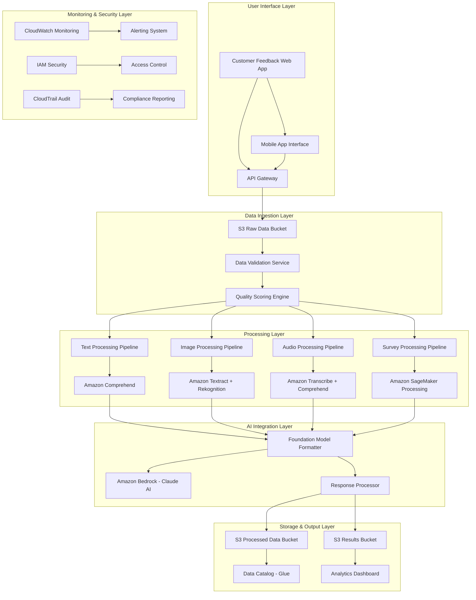

## Data Flow Architecture

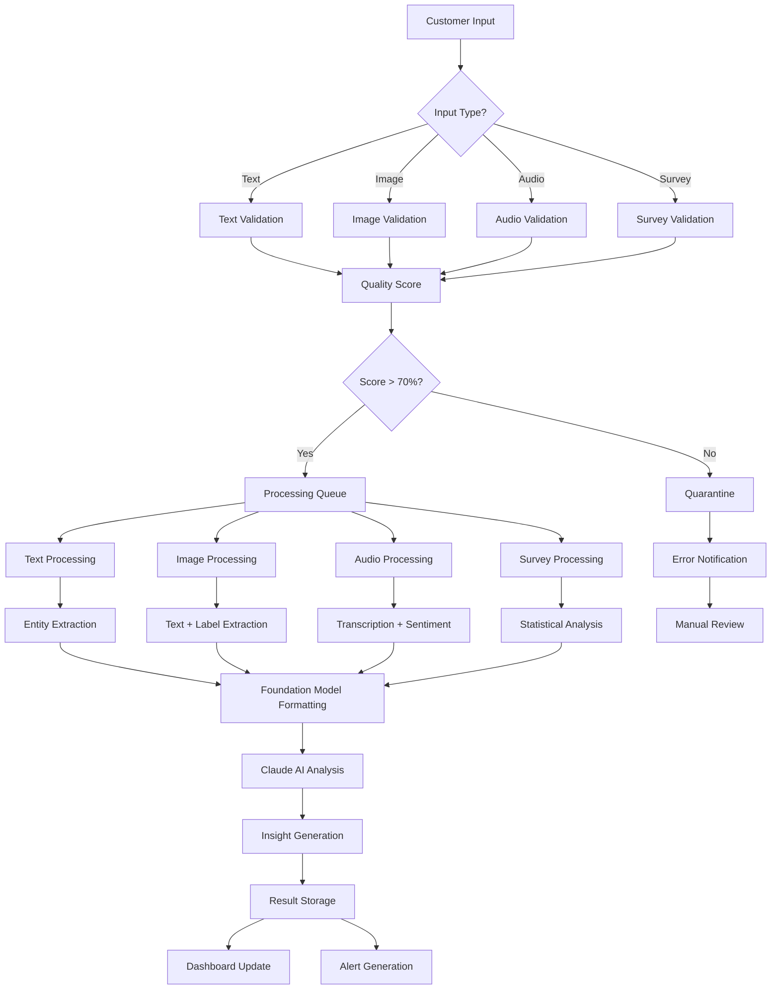

## Component Interaction Diagram

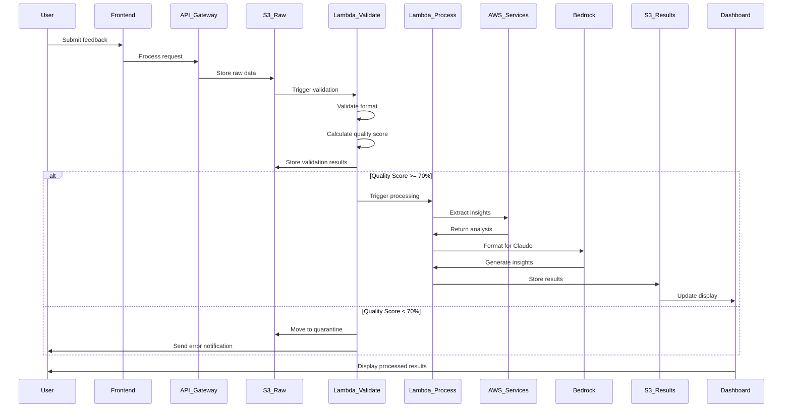

## Service Integration Architecture

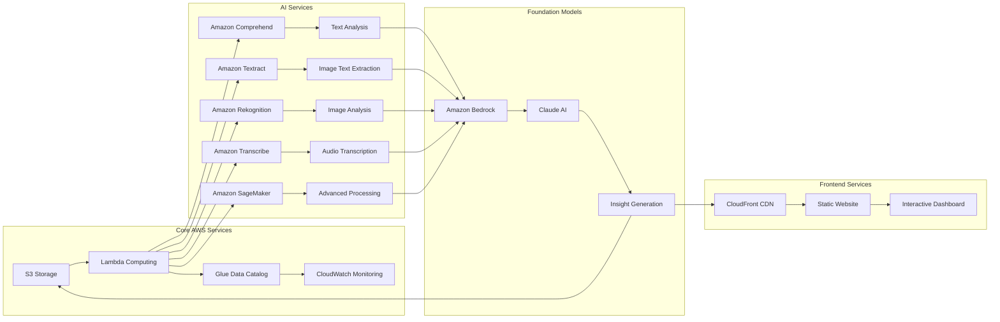

## Security Architecture

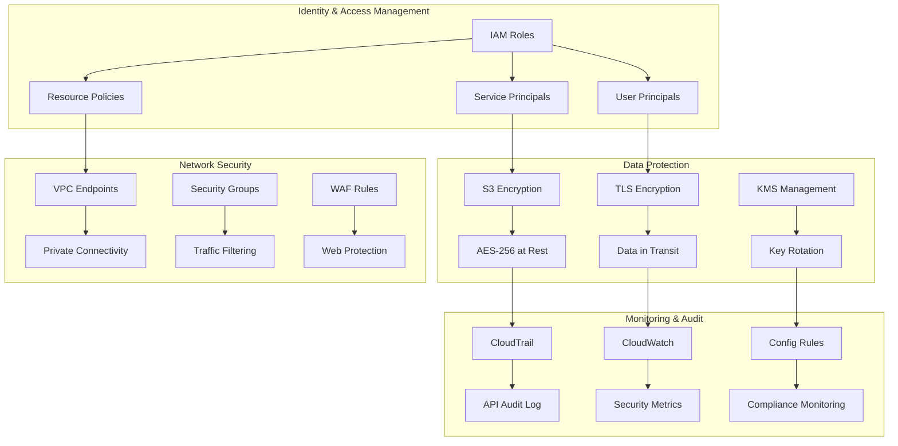

## Performance Architecture

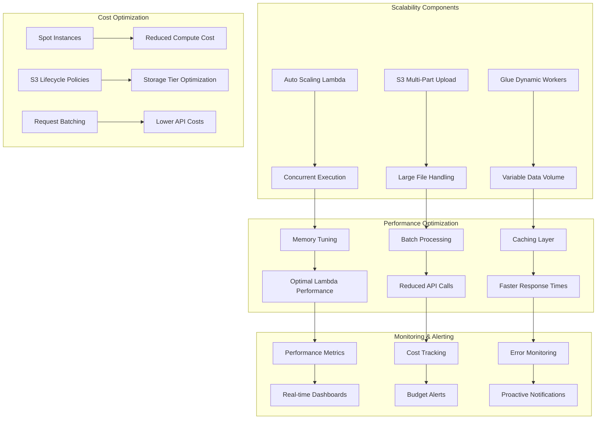

## Deployment Architecture

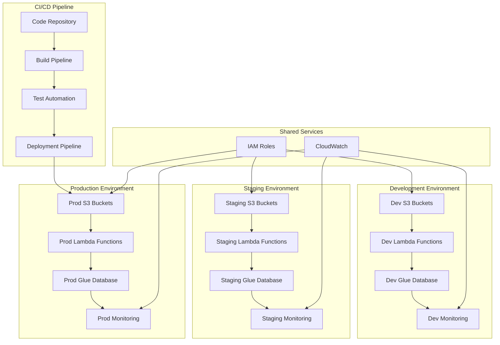

## Data Model Architecture

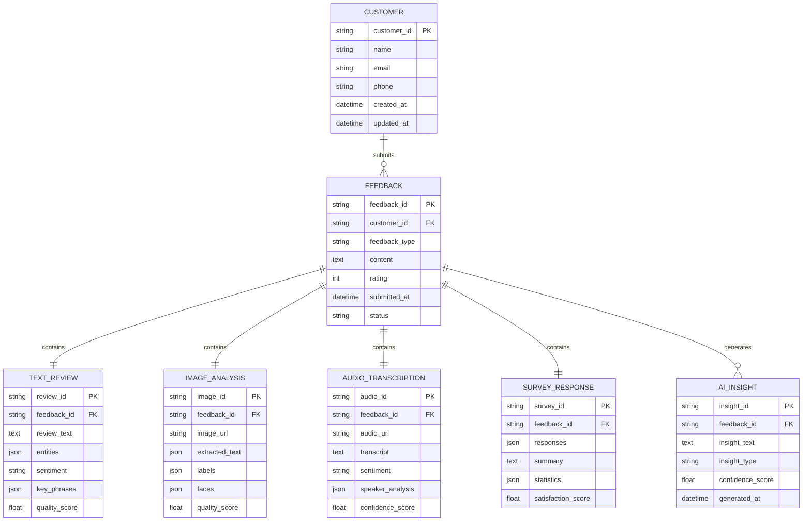

## Integration Patterns

### Event-Driven Pattern
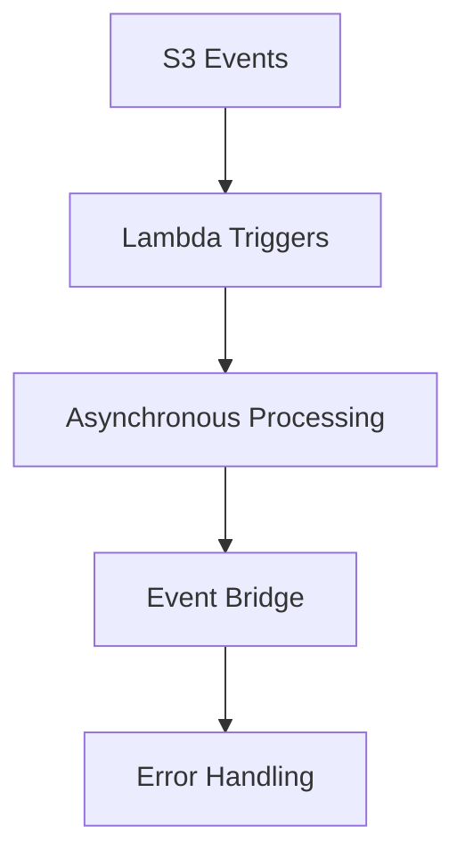

### Request-Response Pattern
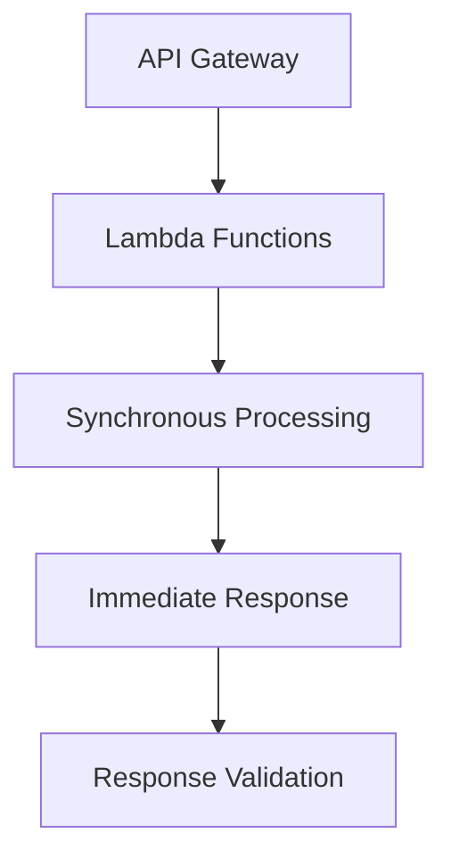

### Queue-Based Pattern
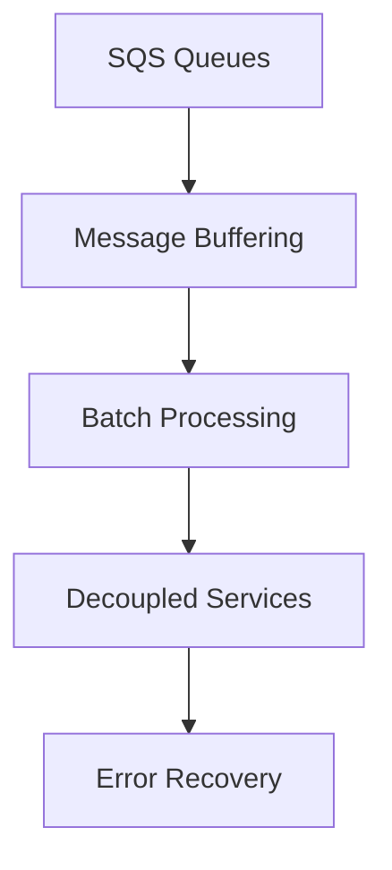

## Technology Stack

### Backend Technologies
- **Python 3.8+**: Lambda functions and data processing
- **AWS Services**: Comprehensive cloud integration
- **Serverless Architecture**: Lambda, API Gateway, S3
- **Event-Driven Processing**: S3 triggers, Step Functions

### AI/ML Services
- **Amazon Comprehend**: Natural language processing
- **Amazon Textract**: Text extraction from images
- **Amazon Rekognition**: Image and video analysis
- **Amazon Transcribe**: Speech-to-text conversion
- **Amazon Bedrock**: Foundation model integration

### Frontend Technologies
- **HTML5/CSS3**: Modern web standards
- **JavaScript ES6+**: Interactive features
- **Chart.js**: Data visualization
- **Responsive Design**: Mobile-first approach

### Infrastructure Technologies
- **AWS CloudFormation**: Infrastructure as code
- **Terraform**: Multi-cloud support
- **Docker**: Container support
- **AWS SAM**: Serverless application model

## Monitoring and Observability

### Key Metrics
- **Processing Latency**: < 30 seconds for 95th percentile
- **System Availability**: 99.9% uptime SLA
- **Error Rate**: < 2% for all operations
- **Scalability**: Handle 10x load increase automatically

### Monitoring Tools
- **CloudWatch**: Metrics and logs
- **X-Ray**: Distributed tracing
- **CloudTrail**: Audit logging
- **AWS Config**: Configuration monitoring

## Security and Compliance

### Data Protection
- **Encryption at Rest**: AES-256 for all S3 storage
- **Encryption in Transit**: TLS 1.2+ for all communications
- **Access Control**: IAM with principle of least privilege
- **Audit Logging**: CloudTrail for all API calls

### Compliance Features
- **Data Retention**: Configurable lifecycle policies
- **Privacy Protection**: PII detection and handling
- **Regional Deployment**: Data residency compliance
- **Monitoring**: Real-time security and compliance dashboards

---

For more detailed technical information, please refer to the [technical design documentation](../technical-design/README.md).